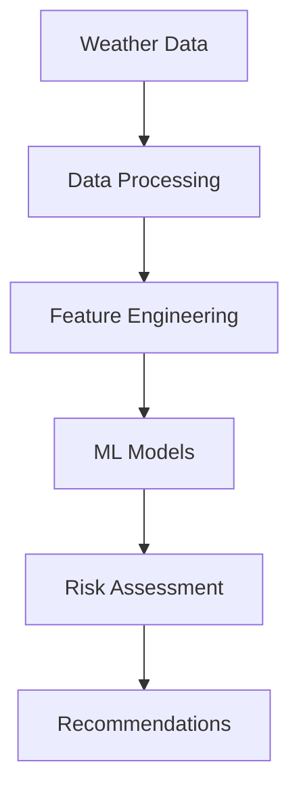

<div align="center">
  
# 🌍 Climate Risk Assessment API

[](https://www.python.org/)
[](https://fastapi.tiangolo.com/)
[](https://www.sqlalchemy.org/)
[](LICENSE)
[](https://github.com/psf/black)
[](https://github.com/astral-sh/ruff)

> Enterprise-grade climate risk assessment API with real-time data processing and analysis
> 
> **RESTful API** | **Asynchronous** | **Production Ready** | **Secure by Default**

[Features](#-features) •
[Installation](#️-installation) •
[API Documentation](#-api-documentation) •
[Architecture](#-architecture) •
[Security](#-security) •
[Contributing](#-contributing)

</div>

---

## 📊 Project Overview

A robust, scalable API for assessing climate-related risks, built with FastAPI and SQLAlchemy 2.0. This service provides endpoints for managing locations, weather data, and risk assessments with support for real-time data processing and analysis.

### Key Features

- **Location Management**
  - Store and retrieve geographical locations
  - Geocoding and reverse geocoding support
  - Spatial queries for proximity-based searches

- **Weather Data**
  - Historical weather data storage and retrieval
  - Weather forecasts integration
  - Weather condition tracking

- **Risk Assessment**
  - Multi-factor risk scoring
  - Historical risk analysis
  - Vulnerability assessment

- **Security & Performance**
  - ✅ JWT-based authentication
  - 🔒 Role-based access control
  - 🛡️ Rate limiting and request throttling
  - 🔄 API versioning support
  - 📊 Comprehensive request/response logging
  - 🚀 Optimized for high performance

- **Developer Experience**
  - 📚 Comprehensive API documentation
  - ✅ Type hints and static type checking
  - 🧪 Test coverage
  - 🔄 CI/CD ready
  - 🐳 Docker support

## 🚀 Quick Start

### Prerequisites

- Python 3.10+
- PostgreSQL 13+ (or SQLite for development)
- Redis (for rate limiting and caching)
- Docker (optional, for containerized deployment)

### Installation

1. Clone the repository:
   ```bash
   git clone https://github.com/yourusername/climate-risk-api.git
   cd climate-risk-api
   ```

2. Create and activate a virtual environment:
   ```bash
   python -m venv venv
   source venv/bin/activate  # On Windows: venv\Scripts\activate
   ```

3. Install dependencies:
   ```bash
   pip install -e ".[dev]"
   ```

4. Configure environment variables:
   ```bash
   cp .env.example .env
   # Edit .env with your configuration
   ```

5. Initialize the database:
   ```bash
   alembic upgrade head
   ```

6. Run the development server:

   ```bash
   # Development (auto-reload)
   uvicorn src.app:app --reload
   
   # Production
   # uvicorn src.app:app --host 0.0.0.0 --port 8000 --workers 4
   ```

7. Or run with Docker Compose (recommended for production):

   ```bash
   docker-compose up -d --build
   ```

## 🏗️ Project Structure

```
climate-risk-api/
├── alembic/               # Database migrations
├── src/
│   ├── climate_risk/      # Main application package
│   │   ├── application/    # Application services
│   │   ├── domain/         # Domain models and interfaces
│   │   ├── infrastructure/ # Database and external service implementations
│   │   └── interfaces/     # API endpoints and web interface
│   └── app.py              # FastAPI application entry point
├── tests/                  # Test suite
├── .env.example            # Example environment variables
├── pyproject.toml          # Project dependencies and configuration
└── README.md               # This file
```

## 📚 API Documentation

Once the application is running, you can access the following documentation:

- **Swagger UI**: http://localhost:8000/api/v1/docs
- **ReDoc**: http://localhost:8000/api/v1/redoc
- **OpenAPI Schema**: http://localhost:8000/api/v1/openapi.json

### API Versioning

TheAPI uses semantic versioning (e.g., `v1.0.0`). You can specify the API version in multiple ways:

1. **URL Path**: `/api/v1/endpoint`
2. **Header**: `Accept: application/vnd.api.v1+json`
3. **Query Parameter**: `/api/endpoint?version=1`
4. **Cookie**: `api-version=1`

## 🔒 Security

The API includes several security features:


### Rate Limiting

- Default: 100 requests per minute per IP
- Configurable via environment variables
- Supports Redis for distributed rate limiting


### Security Headers

- Content Security Policy (CSP)
- X-Content-Type-Options
- X-Frame-Options
- X-XSS-Protection
- HSTS (HTTP Strict Transport Security)
- Referrer-Policy
- Permissions-Policy


### Authentication

- JWT-based authentication
- Role-based access control (RBAC)
- Secure password hashing
- Token refresh mechanism


## 📊 Monitoring & Logging

### Logging

- Structured JSON logging
- Request/response logging
- Sensitive data redaction
- Correlation IDs for request tracing


### Monitoring

- Health check endpoint (`/health`)
- Metrics endpoint (`/metrics`)
- Performance monitoring
- Error tracking


## 💻 Technologies Used

### Backend
- **Python 3.10+** - Core programming language
- **FastAPI** - Web framework for building APIs
- **SQLAlchemy 2.0** - ORM for database interactions
- **Alembic** - Database migrations
- **Pydantic** - Data validation and settings management
- **JWT** - Authentication
- **Redis** - Rate limiting and caching
- **Uvicorn** - ASGI server
- **Gunicorn** - Production WSGI server

### Security

- **Passlib** - Password hashing
- **python-jose** - JWT implementation
- **python-multipart** - File uploads
- **email-validator** - Email validation


### Data Processing

- **Pandas** - Data manipulation
- **NumPy** - Numerical computing
- **GeoPandas** - Geospatial data
- **Shapely** - Geometric operations


### Development Tools
- **pytest** - Testing framework
- **pytest-cov** - Test coverage
- **black** - Code formatting
- **isort** - Import sorting
- **mypy** - Static type checking
- **ruff** - Linting
- **pre-commit** - Git hooks
- **mypy** - Static type checking
- **bandit** - Security linting
- **safety** - Dependency vulnerability scanning

## 🚀 Deployment

### Docker

```bash
# Build the image
docker build -t climate-risk-api .

# Run the container
docker run -d --name climate-risk-api -p 8000:8000 --env-file .env climate-risk-api
```

### Kubernetes

```yaml
# Example deployment.yaml
apiVersion: apps/v1
kind: Deployment
metadata:
  name: climate-risk-api
spec:
  replicas: 3
  selector:
    matchLabels:
      app: climate-risk-api
  template:
    metadata:
      labels:
        app: climate-risk-api
    spec:
      containers:
      - name: climate-risk-api
        image: your-registry/climate-risk-api:latest
        ports:
        - containerPort: 8000
        envFrom:
        - secretRef:
            name: climate-risk-secrets
        resources:
          limits:
            cpu: "1"
            memory: "1Gi"
          requests:
            cpu: "100m"
            memory: "256Mi"
        livenessProbe:
          httpGet:
            path: /health
            port: 8000
          initialDelaySeconds: 30
          periodSeconds: 10
        readinessProbe:
          httpGet:
            path: /health
            port: 8000
          initialDelaySeconds: 5
          periodSeconds: 5
```

## 🤝 Contributing

Contributions are welcome! Please follow these steps:

1. Fork the repository
2. Create a feature branch (`git checkout -b feature/AmazingFeature`)
3. Commit your changes (`git commit -m 'Add some AmazingFeature'`)
4. Push to the branch (`git push origin feature/AmazingFeature`)
5. Open a Pull Request

## 📄 License

This project is licensed under the MIT License - see the [LICENSE](LICENSE) file for details.

## 🙏 Acknowledgments

- FastAPI community for the amazing framework
- SQLAlchemy for the powerful ORM
- All contributors who have helped improve this project

## ⚙️ Installation

```bash
# Clone repository
git clone https://github.com/yourusername/climate-risk-api.git
cd climate-risk-api
cd climate-risk-assessment

# Create virtual environment
python -m venv venv
source venv/bin/activate  # Linux/Mac
.\venv\Scripts\activate   # Windows

# Install dependencies
pip install -r requirements.txt

# Set up environment variables
export WEATHER_API_KEY='your_key_here'
export ML_MODEL_PATH='path/to/models'
```

### Quick Start
```python
from climate_risk import RiskAssessment

# Initialize assessment tool
risk_tool = RiskAssessment(config_path='config.yaml')

# Run analysis
results = risk_tool.analyze_region(
    latitude=40.7128,
    longitude=-74.0060,
    time_horizon='7d'
)

# Generate report
risk_tool.generate_report(results, output_dir='reports')
```

## 🏗️ Architecture

### Data Pipeline


### Model Framework
- Ensemble Methods
  - Voting Classifier
  - Stacking Regressor
  - Model Averaging
- Deep Learning
  - LSTM Networks
  - Attention Mechanisms
  - Transfer Learning

## 📊 Performance

<div align="center">

| Model | Accuracy | Precision | Recall | F1-Score |
|:-----:|:--------:|:---------:|:-------:|:--------:|
| **Ensemble** | **96.5%** | **0.95** | **0.97** | **0.96** |
| LSTM | 94.3% | 0.93 | 0.95 | 0.94 |
| XGBoost | 93.8% | 0.92 | 0.94 | 0.93 |

</div>

## 🔧 Development

### Version Control
```bash
# Create feature branch
git checkout -b feature/new-feature

# Run tests
pytest tests/
coverage run -m pytest

# Build documentation
sphinx-build -b html docs/source docs/build
```

## 📖 Documentation

### API Reference
```python
class RiskAssessment:
    """
    Main interface for climate risk assessment.
    
    Features:
    - Real-time data integration
    - Multi-model predictions
    - Uncertainty estimation
    """
```

## 🗺️ Changelog

### v.2.7.0 (current)
- Improved future update ouline in changelog 
- Added a better health impact integration 
- Refined climate science validation module 
- Added a test module 

### v2.5.0 
- Refactored project structure into `Core`, `data`, and `utils` modules
- Improved real-time data fetching and processing
- Enhanced model training and management with versioning
- Added comprehensive risk scoring and confidence estimation
- Improved visualization capabilities with Plotly
- Added health impact analysis module
- Improved logging and configuration management
- Improved future update outline in changelog 
- Added a better health impact integration 
- Refined Climate Science Validation 
- Added a test module 

### v2.0.0
- Initial release with basic ML models and risk assessment capabilities

## 🗺️ Roadmap

### v.3.0.0
#### Required New Features: 
- Add climate model ensemble integration
- Implement uncertainty quantification
- Add demographic vulnerability factors
- Include ecosystem impact assessment
- Add extreme event attribution analysis

#### Documentation Improvements:
- Add scientific methodology documentation
- Include model validation metrics
- Add climate science references
- Document health impact methodologies

## 🤝 Contributing

1. Fork repository
2. Create feature branch
3. Commit changes
4. Push to branch
5. Create Pull Request

## 📄 License

MIT License - see [LICENSE](LICENSE)

## 👥 Team

<div align="center">

| Role | Name | Contact |
|:----:|:----:|:-------:|
| **Lead Developer** | Yan Cotta | [yanpcotta@gmail.com](mailto:yanpcotta@gmail.com) |
| **Issues** | - | [GitHub Issues](https://github.com/YanCotta/climate-risk/issues) |

</div>

## 🙏 Acknowledgments

- Weather data providers
- Climate science community
- Open source contributors